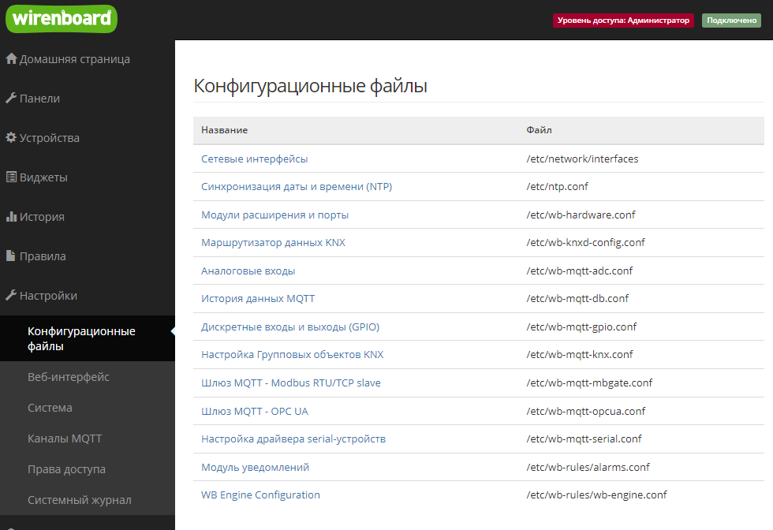
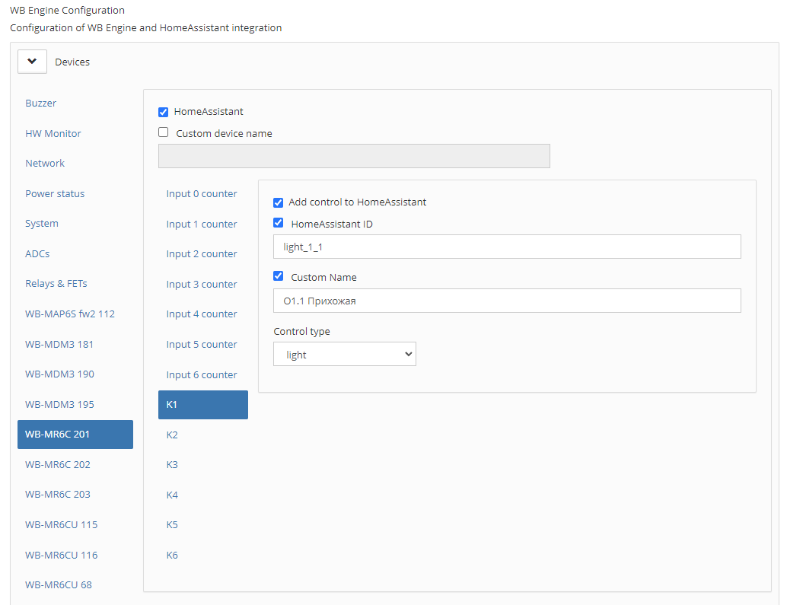
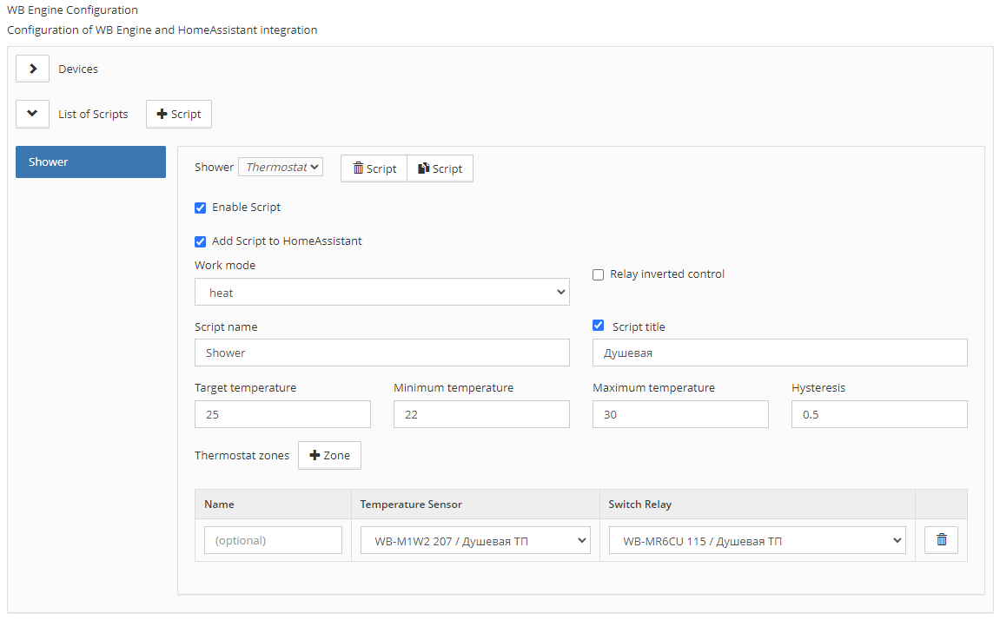
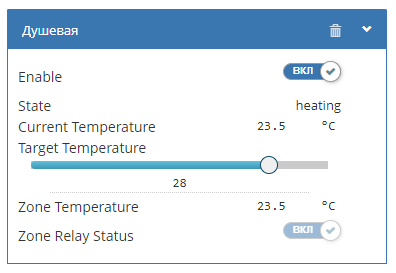
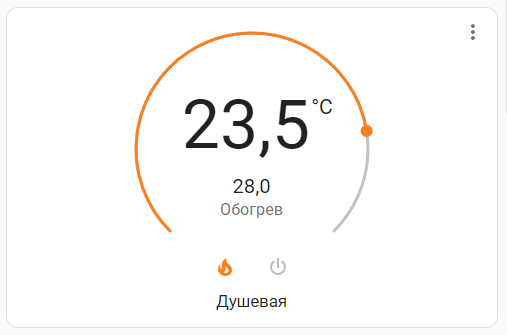

# WirenBoard Engine

Скрипт создан для добавления виртуальных устройств в WirenBoard без написания кода в wb-rules, а также добавления устройств в Home Assistant.

## Пример настройки

<p align="center">
  
  
  
</p>

## Пример созданого виртуального термостата

<p align="center">
  
  
</p>

## Установка

Скачайте файл пакета на устройство WirenBoard и установите с помощью dpkg.

```
wget https://github.com/4mr/wb-engine/releases/download/v0.2.19/wb-engine_0.2.19_armhf.deb
dpkg -i wb-engine_0.2.19_armhf.deb
```
