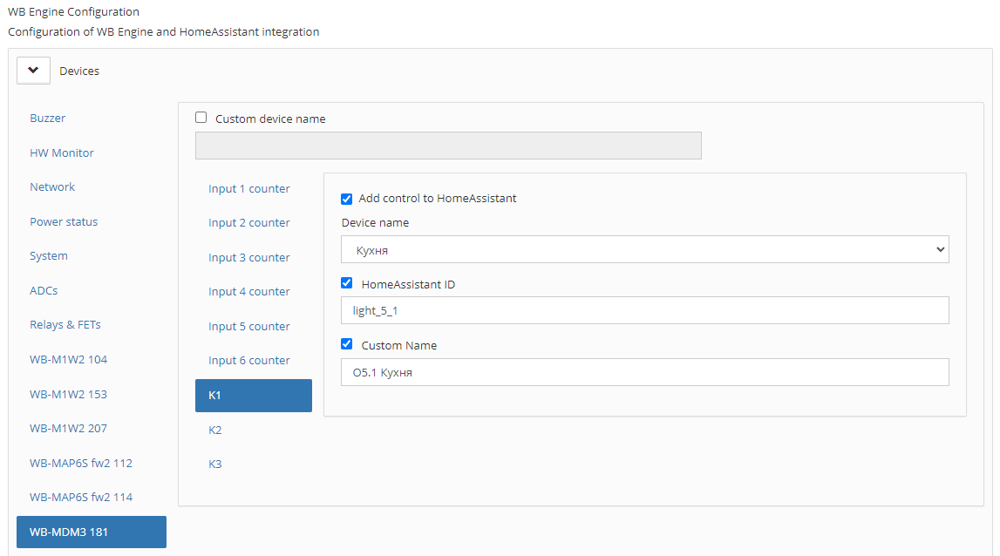
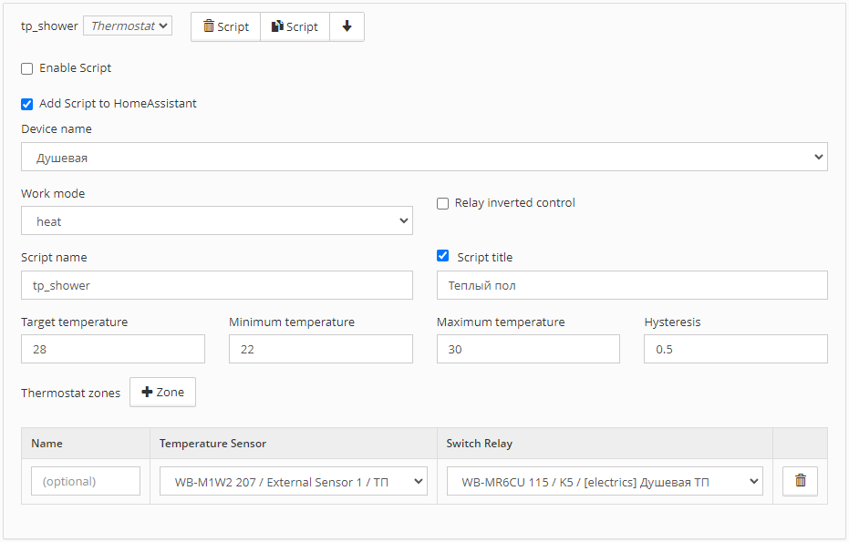
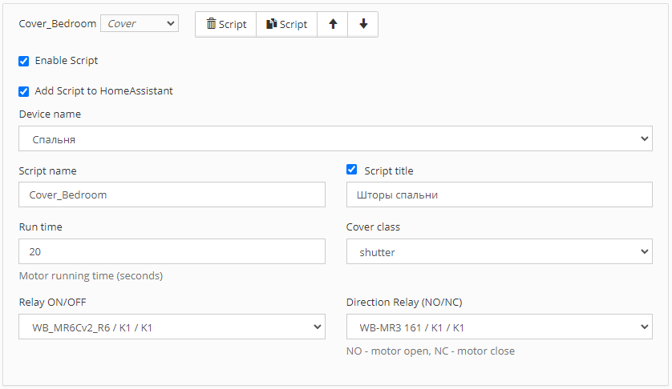
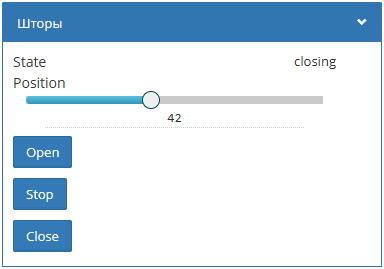

# WirenBoard Engine

Скрипт создан для добавления виртуальных устройств в WirenBoard без написания кода в wb-rules, а также добавления устройств в Home Assistant.

## Пример настройки

<p align="center">
  
  
  
</p>

## Пример созданого виртуального термостата

<p align="center">
  
  
</p>

## Пример создания виртуальных штор (cover)

<p align="center">
  
</p>
<p align="center">
  
  
</p>

## Установка

Скачайте файл пакета на устройство WirenBoard и установите с помощью dpkg.

### Wirenboard 8
```
wget https://github.com/4mr/wb-engine/releases/latest/download/wb-engine_arm64.deb
dpkg -i wb-engine_arm64.deb
rm wb-engine_arm64.deb
```

### Wirenboard 6,7
```
wget https://github.com/4mr/wb-engine/releases/latest/download/wb-engine_armhf.deb
dpkg -i wb-engine_armhf.deb
rm wb-engine_armhf.deb
```
